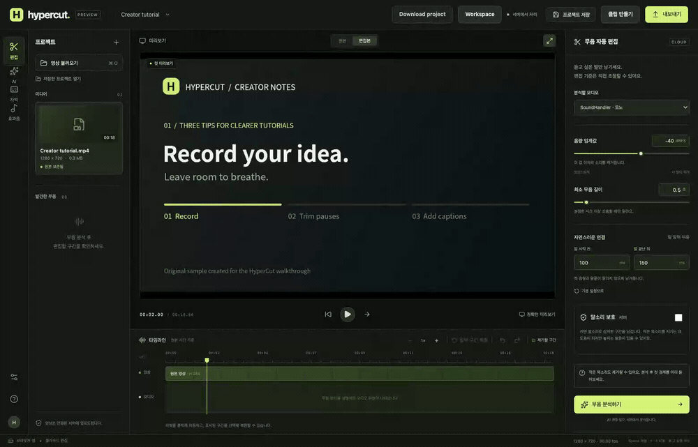
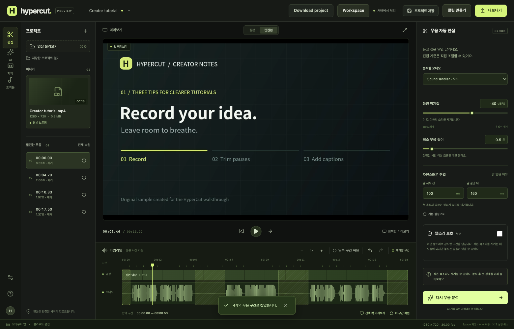
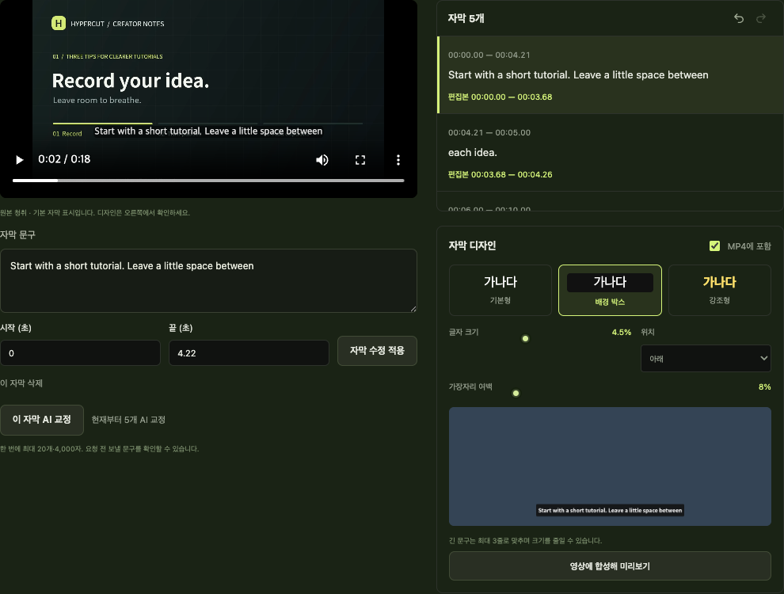
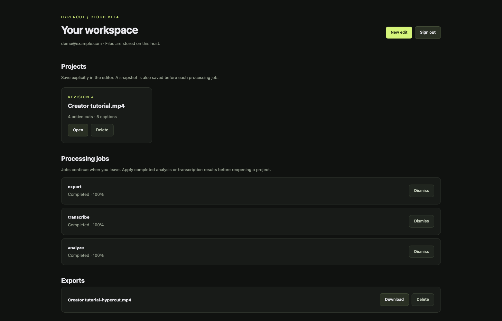

<p align="center">
  
</p>

<h1 align="center">HyperCut</h1>

<p align="center"><strong>Less time cutting pauses. More time creating.</strong></p>

<p align="center">
  <a href="#run-locally">Run locally</a> ·
  <a href="docs/cloud/README.md">Self-host the cloud beta</a> ·
  <a href="CONTRIBUTING.md">Contribute</a> ·
  <a href="LICENSE">GPL-3.0</a>
</p>

A local-first video editor that removes pauses, creates clips, and turns speech into editable captions. Built by [QuokkaCompany](https://github.com/QuokkaCompany), licensed under [GPL-3.0](LICENSE).

HyperCut finds intervals that stay below your chosen audio threshold, then cuts video and audio together. Original media stays intact. Optional speech protection, local transcription, and AI suggestions help you review the edit.

## See HyperCut in action

Import a tutorial, remove pauses, review automatically generated captions, and return to a saved cloud project with a completed MP4.



[Download the full-resolution walkthrough (MP4)](https://raw.githubusercontent.com/QuokkaCompany/hypercut/main/docs/media/walkthrough.mp4) · [Download the captioned result (MP4)](https://raw.githubusercontent.com/QuokkaCompany/hypercut/main/docs/media/edited-tutorial.mp4) · [Capture details and reproduction](docs/media/README.md)

This walkthrough uses an original sample with generated English speech, processed by the running application. Both public videos are **silent**; the walkthrough omits waiting time. The editor is shown in Korean and the cloud workspace in English.

### A short tutorial, from recording to export

| Step | What happened in this sample |
| --- | --- |
| **Trim pauses** | The threshold analyzer found four removable intervals. The video timeline went from **18.87 seconds to 13.00 seconds** after cuts. Each cut remains editable. |
| **Review captions** | Local Whisper produced **five English caption cues**. Their wording and cut crossings were checked, then the background-box style was included in the MP4. |
| **Save and return** | The cloud workspace held the saved project and completed analysis, transcription and export jobs, with a downloadable result. |

<details>
<summary><strong>Silence editing — inspect the waveform and restore cuts</strong></summary>



</details>

<details>
<summary><strong>Caption editing — review the transcript and choose a visual style</strong></summary>



</details>

<details>
<summary><strong>Cloud workspace — reopen a project and download the finished video</strong></summary>



</details>

The timing above describes this generated sample; it is not a human-recording accuracy or editing-speed benchmark.

**Status: early development.** Desktop development and testing currently target macOS on Apple Silicon; the cloud CPU container also has a Linux arm64 validation path. The interface is currently in Korean; project documentation is in English. Human-recording quality, editing-time savings, authenticated AI integrations, and installation on a clean Mac still need validation. This is not a fully validated replacement for a professional editor.

## What you can do

- Remove pauses using an adjustable dBFS threshold, minimum duration, and padding before and after speech.
- Protect detected speech with bundled Silero VAD running locally on the CPU.
- Restore cuts, restore part of a range, zoom the timeline, and undo or redo edits.
- Preview encoded results and export an MP4 with synchronized audio and video.
- Transcribe locally with Whisper, edit caption text and timing, and export SRT or full/edited TXT transcripts.
- Design captions and burn them into video; add, position, trim, mute, and mix local sound effects.
- Create a clip from a source-time range or consecutive transcript sentences.
- Transcribe Korean, English, Japanese, Chinese, Spanish, French, German, Portuguese, Italian, and Russian, or request automatic language detection.
- Review AI proposals for silence settings, caption corrections, translations, and sound-effect placement.
- Save editing state in a project file and reconnect the original media using its SHA-256 identity.

## Local and self-hosted cloud

The independent local edition remains available without an account. The new **single-host cloud beta** adds sign-in, resumable uploads, server-saved projects and a durable worker queue using the same editor and media engine. Users can upload, edit and download outputs from a browser. API restart and browser disconnection preserve submitted jobs and saved projects.

Start with the [cloud setup guide](docs/cloud/README.md), [architecture](docs/cloud/architecture.md), [API contract](docs/cloud/api.md) and [operator limits](docs/cloud/operations.md). The cloud HTTP API is implemented in **Go**, with a private Node media helper and a separate Node worker for FFmpeg, Whisper, VAD and rendering. Direct cloud development requires Go 1.26+ and Node 24+; Docker includes the compiled API, FFmpeg and optional CPU Whisper. The independent local edition does not require Go. Public hosting, billing and multi-host/GPU operation are not provisioned. The workspace uses English; the editing interface remains Korean.

## Run locally

Install Node.js **22.12 or newer** and FFmpeg/ffprobe. On macOS:

```sh
brew install ffmpeg
git clone https://github.com/QuokkaCompany/hypercut.git
cd hypercut
npm ci
npm run build
npm start
```

Open `http://127.0.0.1:4327`. The server listens locally and processes video on this computer. For the desktop window:

```sh
npm run desktop
```

For development, run `npm run dev` and open `http://127.0.0.1:5173`.

### Set up transcription and package the Mac app

```sh
npm run setup:transcription
npm run package:desktop
```

Setup uses Python 3 and Xcode Command Line Tools on Apple Silicon macOS. It builds a pinned whisper.cpp revision and downloads the multilingual Whisper small model (about 488 MB). Completed downloads are hash-checked and reused; interrupted partial downloads restart on the next run. [Download recovery tests](docs/testing/2026-09-06-model-download-recovery-results.md) use local fixtures rather than downloading the real model.

Once installed, transcription requires no account, network connection, or API call. Missing transcription components do not prevent silence editing or editing existing captions. Setup files live under `.hypercut/transcription/`; packaged resources live under `Resources/transcription/`. Tests can override the location with `HYPERCUT_TRANSCRIPTION_DIR`.

Packages are written to `release/` and include the transcription runtime, model, caption fonts, renderer, and license notices. FFmpeg and ffprobe are **external prerequisites**, including on another computer. Override discovery with `FFMPEG_PATH` and `FFPROBE_PATH`. Packages are development builds; signing, notarization, and clean-machine installation are not validated here.

## Editing workflow

1. Import an H.264 SDR MP4 or MOV, or try the built-in 16-second synthetic sample.
2. Choose the microphone track and configure the threshold, minimum pause, and speech padding. Enable speech protection when needed.
3. Analyze silence to create an editable cut draft. Review detected speech and cuts against the source.
4. Restore unwanted cuts or a source-time subrange. Press **R** to toggle the selected cut. Undo and redo are available.
5. Use encoded preview to inspect the actual result. A selected-cut preview defaults to two seconds on each side and opens separately. Fast seeking previews can have playback delays and do not include mixed effects.
6. Export and save the MP4. HyperCut validates duration, tracks, and full decoding before making an export available.
7. Save a project JSON. Keep the source and effect files separately; reopening requires reconnecting matching files. A save finishing after further edits does not clear the newer unsaved state.

The default settings are **−40 dBFS**, **500 ms** minimum silence, **100 ms** before speech, and **150 ms** after speech. These are starting values, not a guarantee of preserving quiet speech. Raising the threshold can remove more speech.

### How cuts work

Threshold analysis compares the absolute value of every decoded sample on every channel. All channels must be below the threshold. Cut boundaries snap inward to video frames; video and audio use the same kept intervals. Audio is assembled continuously and encoded to AAC once.

Optional Silero VAD detects speech independently of the amplitude threshold. It analyzes each channel separately, with normalization up to 100× applied only to analysis input. Output volume is unchanged. Lowering the speech-detection threshold generally preserves more material. VAD can miss quiet speech mixed with noise and does not establish transcription accuracy. Its model and license are bundled in `assets/models/`; inference does not download a model or use an AI account. ONNX Runtime telemetry is disabled before loading.

One selected audio track is exported. HDR and HEVC are not currently supported. Browser sessions are stored in `.hypercut/sessions/`; desktop sessions use the application's user-data directory. Session media is not automatically deleted. Save required outputs before cleaning session files while the app is closed.

## Captions, transcripts, and translations

Open the caption editor, choose a language and transcription channel, and start transcription. Review the original playback before applying text or timing changes. Unsaved inputs prompt before closing or moving to another cue. Caption deletion, edits, undo, redo, and project persistence are supported.

- Export an edited SRT with the same frame-aligned timeline as the rendered video. Removed cues disappear and return when the corresponding cut is restored.
- Export a full UTF-8 TXT transcript, including removed sentences, or an edited TXT containing retained material.
- Review cues crossed by cuts. A review applies only to that text, source timing, and kept range; later changes can require another review.
- Slight end-of-media transcription overflow is clamped only within the allowed final window and marked for review. Confirm the wording and ending before SRT or captioned MP4 export. Larger timing errors are rejected.
- Choose a plain, background-box, or emphasis caption style, size, position, and margins. Enable caption inclusion and inspect an encoded preview. SRT stores text and timing, not the visual design.
- Captions wrap to at most three lines and shrink when needed. Unsupported glyphs, excessive text, missing fonts, or rendering errors block captioned output with an actionable error.

Rendering uses bundled Noto Sans KR, an on-demand Noto Sans CJK KR fallback, `@napi-rs/canvas`, and FFmpeg `overlay`. It does not require libass or read other fonts installed on your machine. See the [font manifest](assets/fonts/manifest.json), [font license](assets/fonts/OFL.txt), and [rendering evidence](docs/testing/2026-09-05-caption-rendering-results.md).

AI correction and translation requests contain at most **20 cues and 4,000 characters** per batch. Compare the original, proposal, and reason before applying selected changes. Correction rejects numeric changes and requires review of negation changes. Project glossary terms have a 2,000-character limit, participate in undo/redo, and do not automatically replace transcript text or call a model. Per-request overrides do not overwrite the saved glossary.

For translation, select a target language and process a batch, then move to the next untranslated cue. Translations preserve source wording and timing in separate language entries. The output language applies to SRT, TXT, and captioned MP4. Missing or stale translations block the affected output until edited or regenerated. Retranscription replaces the source transcript without silently attaching old translations to new sentences.

Actual English, Japanese, and Chinese TTS transcription, plus Japanese automatic detection, has been exercised. Misrecognitions occurred, including Chinese TTS and an earlier Korean sample. These checks do not establish accuracy on human recordings. See [multilingual results](docs/testing/2026-09-06-multilingual-results.md) and [transcription results](docs/testing/2026-09-05-transcription-results.md).

## Clips and sound effects

Create a clip by entering its source start/end times or selecting a first and last transcript sentence. Existing cuts, captions, and sound effects are reflected in the original-resolution output. Inspect the actual frame-aligned range and edited duration. If the range splits a caption, expand it or disable caption inclusion.

Import a local mono or stereo sound effect up to five minutes and 1 GB. Set its source placement, internal offset, duration, gain, and mute state; the default gain is −12 dB. A clip whose starting point is removed is omitted from output and returns when that cut is restored. Encoded previews and MP4 exports include the effects.

Projects store effect hashes and editing values, not the original audio files. Reconnect a matching file when reopening; missing effects must be reconnected, excluded, or muted. If the mix or decoded final AAC contains samples above 0 dBFS, export stops and asks for lower gain. HyperCut does not silently normalize or limit the mix.

AI effect proposals use selected aliases, descriptions, durations, clips, optional reference captions, and kept ranges. They do not send the sound files. Review additions, updates, and deletions before applying. Changes to media, tracks, cuts, effects, or captions invalidate old proposals. See [effect results](docs/testing/2026-09-05-effects-results.md) and [AI effect results](docs/testing/2026-09-05-ai-effects-results.md).

## Optional AI connections

The core editor works without AI. Saving connection settings does not call a model. Each explicit request uses the selected provider; failures do not trigger another provider. Requests do not automatically attach original video, audio, or filenames.

| Connection | Behavior and current limits |
| --- | --- |
| Ollama | Uses a model installed on this computer through a loopback HTTP endpoint. Remote endpoints are rejected. |
| OpenAI API / Anthropic API | Uses a model ID and API key you supply. Keys stay in server memory and are discarded on disconnect or shutdown. API usage is separate from chat subscription assumptions. |
| Claude Code | Uses an installed CLI and its subscription login. Installation and login checks do not request inference. Model file, shell, and MCP tools are disabled. Authenticated inference is still unverified. Use `CLAUDE_CLI_PATH` if discovery fails. |
| Local MCP client | Experimental bridge for explicitly shared requests and returned proposals. Shares last at most 15 minutes and expire 90 seconds after the last app-state check on disconnection. Explicit revocation is confirmed only after a server response. Each share requires new connection settings. |
| Existing ChatGPT or Claude chat | Copy a request, paste it into your chat, and import the JSON response for review. |

ChatGPT MCP connectivity additionally depends on account capabilities and Secure MCP Tunnel configuration. Actual account/tunnel connectivity is unverified. See [MCP results](docs/testing/2026-09-06-mcp-results.md). Mock provider and CLI tests establish application behavior, not real provider quality or account availability. Provider policies and installed versions may change.

Settings proposals send the request and four silence settings. Correction sends selected text, glossary, and instructions. Translation adds the target language. Applying new silence settings requires another analysis before cuts change.

## Project compatibility

New projects use **schema v8**, including captions, styles, effects, glossary terms, end-boundary review, and per-language translations. Versions v1–v7 remain readable. Missing newer fields receive defaults: early projects have no captions/effects/glossary, and v1–v3 do not enable caption burn-in automatically. Existing supported styles, terms, and captions are preserved. Older HyperCut versions may not open v8 projects.

## Validation and contributing

Start with the [validation status](docs/testing/README.md), [plan index](docs/plans/README.md), [validation plan](docs/plans/2026-09-05-validation-plan.md), and [test plan](docs/plans/2026-09-05-test-plan.md). Historical results identify their own builds and limitations; passing synthetic tests is not a claim that the full MVP gate has passed.

```sh
npm test
npm run build
npm run test:media
npm run test:api
```

Additional scripts cover VAD, transcription, captions, effects, MCP, cancellation, recovery, browser/desktop workflows, and long recordings. Their setup requirements and evidence are listed in the [testing guide](docs/testing/README.md). Use a fresh `--output=test-output/<run-name>` directory for repeated benchmarks. Long runs and native UI tests are not part of the quick contributor checks.

Read [CONTRIBUTING.md](CONTRIBUTING.md) before opening a change. Report reproducible bugs through [GitHub Issues](https://github.com/QuokkaCompany/hypercut/issues), follow the [community guidelines](CODE_OF_CONDUCT.md), and use the [security policy](SECURITY.md) for vulnerabilities.

HyperCut's original code is licensed under [GPL-3.0-only](LICENSE). Bundled fonts, models, and dependencies retain their own licenses; see [third-party notices](THIRD_PARTY_NOTICES.md). Private recordings, reports, downloaded runtimes, and generated test outputs are excluded from the repository. The explicitly published [README showcase assets](docs/media/README.md) are versioned under `docs/media/`.
