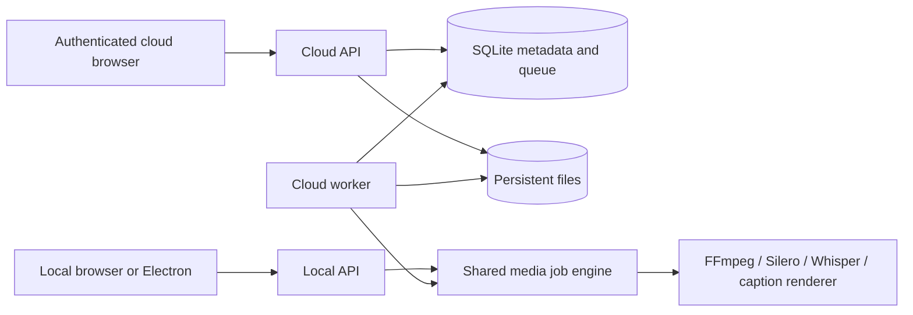

# Architecture and contribution boundaries

`server/engine.mjs` owns job validation and execution. It delegates to the existing media, speech, caption and effects modules. `server/app.mjs` preserves the loopback API and in-memory local job lifecycle. `server/cloud/app.mjs` is a separate authenticated transport. Changing one transport must not weaken the other's boundaries.

`server/cloud/store.mjs` owns SQLite setup and account/session primitives. Metadata is stored in owner-indexed records, with short `BEGIN IMMEDIATE` transactions for reservations, project versions, queue claims and result publication. WAL supports the API and worker on the same local filesystem. Database paths and original filenames are never accepted as job source locations.

`server/cloud/uploads.mjs` accepts 8 MiB chunks, checks SHA-256, syncs files before committing offsets and uses generated upload directories. A duplicate chunk is accepted only if its committed hash matches. Completion assembles and inspects the media, then publishes an owned asset and idempotent result in one metadata transaction. Abandoned parts remain visible for explicit removal. Container/codec validation rejects playlists and unsupported sources.

`server/cloud/jobs.mjs` stores immutable job input and the optional project revision. Supported jobs are analyze, restore, transcribe, preview, export, captions and transcript. The worker claims a queued job transactionally, heartbeats its lease and executes in a unique attempt directory. Cancellation sets a persistent flag. Only the current attempt can commit a completed result. Expired attempts become failed rather than being automatically replayed.

`src/Cloud.tsx` routes runtime mode and provides sign-in, a workspace and cloud save callbacks. `src/App.tsx` remains the editing UI. Before submitting a cloud job it persists the project snapshot, then uses the same media job contract as the local edition. `src/api.ts` handles session CSRF tokens, resumable cloud uploads and queued/running polling. Cloud mode reports server processing in the editor.

## Portability and future work

Both editions use portable project schema v8 and the same cut/caption/effect validators. Cloud record IDs and revisions wrap the portable document rather than changing its format. A contributor can improve silence decisions, caption mapping or export behavior once and exercise both transports.

The filesystem and SQLite modules are concrete single-host implementations. They are not an S3 or distributed queue abstraction masquerading as a finished implementation. A future multi-host change needs object storage, transactional queue claims across hosts, input/output lifecycle rules, worker fencing, migrations, backups and new cross-host failure tests. GPU scheduling also needs explicit resource limits and deployment-specific validation.

Do not add cloud-only editing feature gates. Authentication, storage, operations and future billing belong around the engine; offline editing should continue to work without an account or network service.
