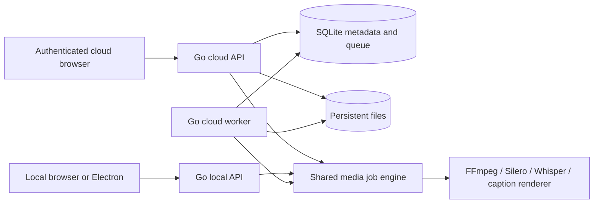

# Architecture and contribution boundaries

`internal/media/` owns job validation and execution, sample-accurate timeline/audio processing, native caption rendering, Silero inference and Whisper orchestration. `internal/local/` provides the independent loopback API, in-memory jobs and protected desktop file saving. `internal/ai/` contains provider adapters, scoped shares and the stdio MCP server. `cmd/hypercut-cloud` selects local, cloud API, worker, user, healthcheck or MCP mode. The former JavaScript implementation exists only under `tests/reference/server/` for regression comparison and is excluded from distributions.

`internal/cloud/store.go` owns SQLite/account/session primitives. Schema version 1, scrypt parameters and hashed cookie identities remain compatible with existing installations. Metadata uses short `BEGIN IMMEDIATE` transactions for reservations, project versions, queue claims and result publication. WAL supports API and worker on the same local filesystem. Database paths and original filenames are never accepted as job source locations.

`internal/cloud/bridge.go` is now an in-process dispatcher into the shared Go engine. There is no Node child, private helper socket or JavaScript interpreter. Ownership is checked before resolved records reach the engine. Cancellation propagates to native child process groups. The backend binary requires the documented fonts, models and native ONNX Runtime library, plus FFmpeg/ffprobe.

`internal/cloud/uploads.go` accepts 8 MiB chunks, checks SHA-256, syncs files and their directory before committing offsets and uses generated upload directories. A duplicate chunk is accepted only if its committed hash matches. Completion assembles and inspects the media, then publishes an owned asset and idempotent result in one metadata transaction. Abandoned parts remain visible for explicit removal. Container/codec validation rejects playlists and unsupported sources.

`internal/cloud/jobs.go` stores immutable job input and the optional project revision. Supported jobs are analyze, restore, transcribe, preview, export, captions and transcript. `internal/cloud/worker.go` claims a queued job transactionally, heartbeats its lease and executes in a unique attempt directory. Cancellation sets a persistent flag. Only the current attempt can commit a completed result. Expired attempts become failed rather than being automatically replayed. Both Go editions share these contracts; the cloud API and Go worker are exercised together by integration/browser scenarios.

`src/Cloud.tsx` routes runtime mode and provides sign-in, a workspace and cloud save callbacks. `src/App.tsx` remains the editing UI. Before submitting a cloud job it persists the project snapshot, then uses the same media job contract as the local edition. `src/api.ts` handles session CSRF tokens, resumable cloud uploads and queued/running polling. Cloud mode reports server processing in the editor.

## Portability and future work

Both editions use portable project schema v8 and the same cut/caption/effect validators. Cloud record IDs and revisions wrap the portable document rather than changing its format. A contributor can improve silence decisions, caption mapping or export behavior once and exercise both transports.

The filesystem and SQLite modules are concrete single-host implementations. They are not an S3 or distributed queue abstraction masquerading as a finished implementation. A future multi-host change needs object storage, transactional queue claims across hosts, input/output lifecycle rules, worker fencing, migrations, backups and new cross-host failure tests. GPU scheduling also needs explicit resource limits and deployment-specific validation.

Do not add cloud-only editing feature gates. Authentication, storage, operations and future billing belong around the engine; offline editing should continue to work without an account or network service.
